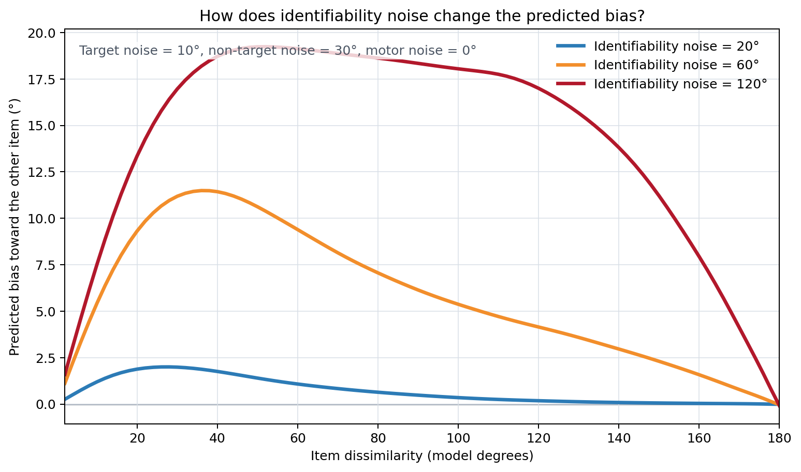
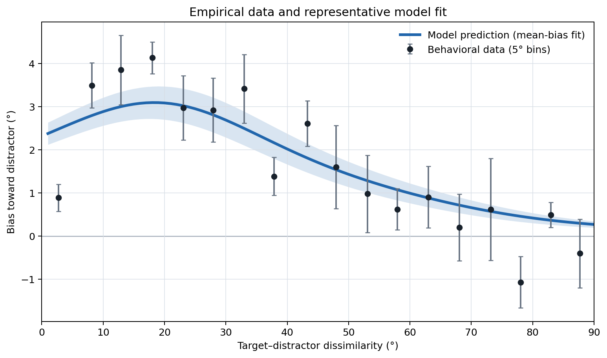

# Demixing Model

Current planned work is listed only in `TODO.md`; completed and superseded
transition and architecture work is summarized in `HISTORY.md`.

The Demixing Model explains why a remembered/perceived/evaluated item can be biased toward or away from another item. The central idea is that the brain must separate two noisy, overlapping memory representations. Depending on how similar the items are and where the noise occurs, this separation can produce either attraction or repulsion. This is a normative, ideal-observer model: attraction or repulsion is unavoidable when the observer attempts to estimate the stimulus parameters accurately.

The computationally expensive simulations have already been summarized in two trained model files included in `pretrained/`. **You can fit experimental data or generate theoretical predictions without downloading additional model data.**

## Generating predictions and fitting the model to data

The Demixing Model can be used in two ways. Its main strength is **generating theoretical predictions**. As a normative model, it formalizes how an observer should separate overlapping, noisy representations under specified assumptions. You can choose values for target and non-target item noise, identifiability noise, and motor noise, and examine the resulting predictions for response bias and variability as stimulus dissimilarity changes. See [Generate predictions](#generate-predictions) for an example.

The model can also be **fitted to experimental data**. Given stimulus similarity on each trial and continuous response errors, the model estimates the noise parameters that best describe each participant and condition and produces plots comparing its predictions with the observed data. See [Fit behavioral data](#fit-behavioral-data) for a complete demo.

Both uses rely on the pre-created model files included in the repository. Recreating these files through simulations is an advanced use described [below](#advanced-use-raw-surfaces-and-the-full-pipeline).

## Installation

Python 3.10+ is required. An **NVIDIA GPU** is strongly recommended for fitting; generating a small set of predictions is less demanding.

- **Recommended:** download or clone the repository, open its folder in VS Code, and choose **Dev Containers: Reopen in Container**. This provides Python, R, and the GPU libraries without requiring you to configure them separately.
- **CPU:** select `.devcontainer/cpu/devcontainer.json`. It works on Intel and Apple Silicon but fitting is much slower.
- **Manual installation:** create a Python environment and run `python -m pip install .` for CPU or `python -m pip install ".[cuda]"` for a computer that already has CUDA 13.

For more detailed instructions, see the step-by-step [installation guide](INSTALL.md).

## Generate predictions

A prediction analysis starts with a scientific question such as: *How should the bias curve change if uncertainty in the identifiability dimension increases while feature noise stays the same?* The included example evaluates three identifiability-noise values while keeping the target and non-target item noise fixed:

| Target feature noise | Non-target feature noise | Identifiability noise |
|---:|---:|---:|
| 10° | 30° | 20° |
| 10° | 30° | 60° |
| 10° | 30° | 120° |

```bash
python surface_simulator_for_predictions/surface_simulator.py \
  --input-path example_data/prediction_parameters.csv \
  --n-samples 20 \
  --output-path results/prediction_example.parquet \
  --skip-motor-noise
```

The `--n-samples 20` selects one of the two versions of the model and loads the matching trained model file automatically. Pass `--checkpoint-path` only to override that choice. The output is a table containing the predicted mean bias, density asymmetry, and response variability at each level of stimulus dissimilarity. Parquet is used because it preserves each curve as a numeric array; the tool can also write CSV.



This standard prediction route uses the included trained model and needs no additional surfaces. The standard WNM prediction API covers the reported mu1 bias distribution. Separate mu2 spatial-bias outputs remain available only from raw averaged simulation surfaces.

See [surface_simulator_for_predictions/README.md](surface_simulator_for_predictions/README.md) for CSV/Parquet details, raw-surface mode, and the R wrapper.

## Fit behavioral data

### Run the WNM demo

From the repository root:

```bash
python demo_fischer_whitney.py
```

The script downloads the <a href="https://doi.org/10.1038/nn.3689" title="Fischer, J., &amp; Whitney, D. (2014). Serial dependence in visual perception. Nature Neuroscience, 17(5), 738–743. https://doi.org/10.1038/nn.3689">Fischer and Whitney (2014)</a> orientation dataset, prepares a standard CSV, fits the packaged 20- and 100-sample WNM observer models using five fitting criteria, exports fitted curves/parameters, and saves the subject, group-average, and PDF-slice plots under:

```text
results/fischer_whitney_20samples_circular/
results/fischer_whitney_100samples_circular/
```

The first run requires an internet connection to download the data. It performs more work than a minimal fit and can be slow on a CPU. The demo intentionally uses the same CSV-first WNM interface intended for ordinary end users.



The figure shows a representative fit of the mean bias curve using the 20-sample model. The full demo also evaluates distribution-based fitting criteria.

### Fit your own CSV

The default column contract is:

| Column | Meaning |
|---|---|
| `expName` | Name or identifier of the experiment |
| `subject` | Participant identifier |
| `condition` | Experimental condition; conditions are estimated separately within each participant |
| `abs_td_dist` | Absolute difference between the target and competing stimulus |
| `bias_to_distr_corr` | Signed response error relative to the competing stimulus; positive means attraction and negative means repulsion |
| `is_outlier` | Optional: use 1 for trials that should be excluded and 0 otherwise |

The column names can be changed through command-line options. By default, a participant-condition is included only if it contains at least 30 usable trials.

CSV is the standard end-user input. With no checkpoint or search override,
the command uses the packaged WNM for `--n-samples 20` and the continuous
multistart optimizer. The CSV itself defines the trial population, column
mapping, outlier rule, and empirical fitting targets.

For controlled **model-comparison or multi-dataset production analyses**, prefer
a compiled `contextual_biases_database` bundle instead. A bundle freezes those
empirical choices upstream so two model families cannot silently use different
trial populations, bandwidths, or observed-design operators. That extra
infrastructure is useful for comparative projects, not a prerequisite for
fitting the Demixing Model to your own data.

```bash
python model_fit_to_data/fit_model_to_data.py \
  --data-path path/to/trials.csv \
  --output-dir my_study \
  --n-samples 20 \
  --include-methods density
```

For orientation experiments, add `--circ-space 180`: orientations repeat after 180°, stimulus differences span 0–90°, and response errors span ±90°. For color, direction, or another variable defined around a full circle, keep the 360° default. This choice is important because it changes how angles are represented inside the model.

Useful options include `--n-samples`, `--min-trials`, `--include-outliers`, `--no-resume`, and `--continuous-starts`. The default `density` criterion matches how the asymmetry of the response distribution changes with stimulus dissimilarity. For a maintained mean-bias objective, use `smoothed_exp`, which compares the observed-design-smoothed circular mean curve. The older hard-binned `expectation` objective is retained only for historical reproduction. The [fitting documentation](model_fit_to_data/Batch_Fit_Analysis_Pipeline_Documentation.md) explains the objectives and when they differ, along with the historical surface and current continuous search paths and the fingerprint that stops results computed different ways from being mixed.

The main result file contains fitted parameters, losses, stored empirical targets, and the metadata needed to reproduce predictions. Predicted curves are recomputed from the fingerprinted surrogate rather than stored as an unversioned cache. A progress file allows an interrupted analysis to continue, and a run-fingerprint file records how the results were produced so a later run cannot append fits computed under different settings. After generating plots and exports, the folder will look like this:

```text
results/my_study/
├── extended_fit_results.pkl        # complete reusable fit object
├── extended_run_fingerprint.json   # how these results were produced
├── extended_progress.json          # resume state
├── csv_exports/                    # created by export_wnm_fit_curves.py
├── pdf_slice_plots/
├── summary_plots/
└── unified_subject_plots/
```

Export fitted WNM tables and generate plots after fitting:

```bash
python model_fit_to_data/export_wnm_fit_curves.py \
  --results-dir results/my_study \
  --output-dir results/my_study/csv_exports

python model_fit_to_data/create_unified_subject_plots.py \
  --results-path results/my_study/extended_fit_results.pkl \
  --output-dir results/my_study \
  --summary-plots --no-individual-plots

python model_fit_to_data/plot_pdf_slices.py \
  --results-path results/my_study/extended_fit_results.pkl \
  --output-dir results/my_study \
  --optimizer density
```

Both plotters recover the fitted surrogate from the run fingerprint. For
compiled bundle fits they use stored analysis-cell metadata instead of parsing
the opaque analysis-cell ID. Advanced users can create per-trial likelihood
exports with `model_fit_to_data/postprocess_fitted_likelihoods.py`. The full
fitting interface and file descriptions are documented in
[Batch_Fit_Analysis_Pipeline_Documentation.md](model_fit_to_data/Batch_Fit_Analysis_Pipeline_Documentation.md).

### Compiled bundles for controlled model comparison

The optional compiled-bundle path is intended for projects that need empirical
definitions shared across model families and datasets. A
`contextual_biases_database` bundle fixes trial geometry, scoring populations,
bandwidths, and empirical targets before fitting. The companion comparison
pipeline (`bias_model_comparison/pipeline/regenerate_compiled_fits.py`) uses
this route:

```bash
python model_fit_to_data/fit_model_to_data.py \
  --bundle ../contextual_biases_database/data/bundles/<dataset>/<analysis> \
  --n-samples 100 \
  --output-dir results/<dataset>
python model_fit_to_data/export_wnm_fit_curves.py \
  --results-dir results/<dataset> \
  --output-dir results/<dataset>/csv_exports
```

`create_unified_subject_plots.py` is plotting-only. Tabular WNM fit products are written by `export_wnm_fit_curves.py`. For ordinary CSV fits it writes fitted parameters and curves; for compiled bundles it additionally writes provenance-bound per-trial likelihood products and replay checks because stable upstream row identities are available. It verifies that
their summed likelihood reproduces the fitted objective under the run's recorded
matrix-precision setting. Angular parameters and scores are exported in both
explicit 360° model units (`*_model_deg`, `*_model_deg2`) and study-scale physical
units (`*_deg`, `*_deg2`); the unsuffixed legacy SD columns remain model degrees.

## What the parameters mean

- **Target feature noise (`sd_feat1`):** uncertainty in the remembered feature of the item whose response is being modeled.
- **Non-target feature noise (`sd_feat2`):** uncertainty in the other item's remembered feature.
- **Identifiability noise (`sd_spat` in code and stored outputs; historically also called `sd_ident`):** uncertainty along the non-reported dimension or dimensions that allow the observer to distinguish which signals came from which item. The code name reflects the original spatial-identifiability formulation, but the same parameter can represent timing or other identity-supporting dimensions. During fitting, it is shared across a participant's conditions.
- **Motor noise (`sd_motor`):** optional variability added at the response stage. It is set to zero by default because estimating it makes fitting slower.
- **20 vs. 100 samples per item:** the number of noisy internal evidence samples the model assumes are available for separating the two representations. This is a theoretical assumption, not the number of experimental trials. See [pretrained/README.md](pretrained/README.md) for technical training details.
- **Likelihood surface:** the model's full predicted distribution of response errors across levels of stimulus dissimilarity for one parameter combination.

The included model families use circular 360° model geometry. Their validated
parameter domains are not identical: the legacy surface NN starts at 5° on all
three SD axes, while the WNM extends the feature-SD axes to 2.5° and retains a
5° lower bound for spatial/identifiability SD. The fitting interface reads bounds
from the selected surrogate. Axial 180° behavioral data are transformed into
model space before fitting.

## Advanced use: raw surfaces and the full pipeline

Averaged surfaces are intermediate files produced by the original simulations. They are **not included in the repository and are not currently available as downloads**. You do not need them to fit data or generate the standard predictions described above. They are needed only to inspect the simulation output directly, study the secondary mixture component, or retrain the model.

The browser can evaluate the packaged wrapped-normal mixture (WNM) directly at
continuous parameter values. It does not need averaged surfaces for this view:

```bash
streamlit run surface_browser/main_app.py
```

If averaged surfaces are available locally, point the browser at their artifact
root to enable the stored-surface views and compare a direct WNM prediction with
the simulated surface at the same parameter triple:

```bash
DEMIXING_ARTIFACT_ROOT=/path/to/artifacts \
  streamlit run surface_browser/main_app.py
```

The stored-surface views are intended for researchers who already generated or
received these files. If compressed files are used, the selected directory must
be writable because the browser extracts individual surfaces as needed. The WNM
view evaluates the packaged model directly; it never reads a corpus-derived or
interpolated surface.

The current WNM training and analysis pipeline is:

1. Simulate two-item mixture-inference samples and accumulate the WNM training corpus with the tools under `surface_computation/`.
2. Train/package the conditional wrapped-normal mixture with the tools under `surrogate_training/wnm/`.
3. Fit behavioral data with `model_fit_to_data/fit_model_to_data.py`.
4. Generate fitted tables/plots and theoretical prediction curves with `model_fit_to_data/` and `surface_simulator_for_predictions/`.

The older averaged-surface and neural-network training pipeline remains in the
repository for historical reproduction and for retained raw-surface/mu2 analyses;
it is not the default fitted surrogate.

Recreating the complete 5° parameter grid is a large, distributed GPU analysis, not a normal step in using the model. Consult the detailed computational documentation before launching it:

- [Simulated Samples Grid Pipeline](surface_computation/Likelihood_Surface_Pipeline_Documentation.md)
- [Neural Network Optimization Pipeline](neural_network_optimization/Neural_Network_Optimization_Pipeline_Documentation.md)
- [Batch Fit Analysis Pipeline](model_fit_to_data/Batch_Fit_Analysis_Pipeline_Documentation.md)
- [Vast.ai Surface Pipeline](cloud/README_vast.md)

## Reproduce the project analyses

This repository contains the Demixing Model itself. Preparing all published datasets, running both model families, comparing them, and rendering the reports are handled by the companion [`bias_model_comparison`](https://github.com/achetverikov/bias_model_comparison) repository. With the three project repositories arranged as siblings:

```bash
cd ../bias_model_comparison
python pipeline/regenerate_compiled_fits.py
Rscript analysis/build_compiled_comparison_artifact.R --include-motor-noise
quarto render analysis/compare_demixing_alt_fits.qmd
```

The pipeline accepts environment overrides such as `DEMIXING_MODEL`, `RESULTS`, and dataset roots; see that repository's README. Full reproduction requires the source datasets and substantial GPU time. The included trained models remove the need to regenerate simulation surfaces unless the training pipeline itself is under study.

## Where to find things

### Production package layout

The current WNM architecture is organized by function:

- `shared/wnm.py` contains the maintained wrapped-normal-mixture runtime and artifact format.
- `shared/prediction.py` is the family-aware prediction API used by fitting, plotting, exports, and public prediction tools.
- `model_fit_to_data/` owns fitting objectives, target construction, optimization, result identity, likelihood replay, exports, and plotting.
- `surrogate_training/wnm/` owns WNM training and packaging.
- `surface_computation/` owns simulation, WNM design/training-data generation, and the retained historical surface-generation path.

The former `continuous_density/` transition namespace has been removed. Historical transition evidence is preserved under `docs/history/wnm_transition/` and in git history.


- `demo_fischer_whitney.py` — end-to-end fitting demonstration.
- `example_data/` — small fitting and prediction inputs.
- `pretrained/` — the included 20- and 100-sample trained models.
- `model_fit_to_data/` — fitting, postprocessing, and plotting.
- `surface_simulator_for_predictions/` — Python and R prediction interfaces.
- `surface_computation/` — simulation, WNM design, training-data generation, and historical likelihood-surface generation.
- `surrogate_training/wnm/` — WNM training and artifact packaging.
- `neural_network_optimization/` — historical surface-NN averaging/training code retained for reproduction.
- `surface_browser/` — Streamlit browser for locally available surfaces.
- `shared/` — internal functions used by several parts of the model.
- `cloud/` — distributed Vast.ai/object-store tooling and benchmarks.
- `tests/` — focused tests, a WNM end-to-end smoke, and historical surface-generation smokes.
- `docs/` — README figure assets/generators plus archived transition findings under `docs/history/wnm_transition/`.

## Check that the installation works

Run the short checks first:

```bash
python -m pytest tests
```

The following tests recreate small versions of the computational pipeline and are considerably slower:

```bash
bash tests/run_smoke_wnm.sh
# Historical surface-generation checks:
bash tests/run_smoke_pipeline.sh
bash tests/run_smoke_standard.sh
bash tests/run_smoke_compare_seeds.sh
```

See [INSTALL.md](INSTALL.md#verification) for GPU/CPU controls and [tests/README.md](tests/README.md) for their scope.

## License, citation, and disclaimer

The code is distributed under the [MIT License](LICENSE).

If you use the model or demo, cite the relevant work:

- <a href="https://doi.org/10.1101/2023.03.26.534226" title="Chetverikov, A. (2023). Demixing model: A normative explanation for inter-item biases in memory and perception. bioRxiv. https://doi.org/10.1101/2023.03.26.534226">Chetverikov, A. (2023). Demixing model: A normative explanation for inter-item biases in memory and perception. <em>bioRxiv</em>.</a>
- <a href="https://doi.org/10.7554/eLife.111380.1" title="Chetverikov, A., &amp; Hansmann-Roth, S. (2026). Noise in competing representations determines the direction of memory biases. eLife, 15, RP111380. https://doi.org/10.7554/eLife.111380.1">Chetverikov, A., &amp; Hansmann-Roth, S. (2026). Noise in competing representations determines the direction of memory biases. <em>eLife, 15</em>, RP111380.</a>
- <a href="https://doi.org/10.1038/nn.3689" title="Fischer, J., &amp; Whitney, D. (2014). Serial dependence in visual perception. Nature Neuroscience, 17(5), 738–743. https://doi.org/10.1038/nn.3689">Fischer, J., &amp; Whitney, D. (2014). Serial dependence in visual perception. <em>Nature Neuroscience, 17</em>(5), 738–743.</a>

The code and documentation are provided as-is without warranty. Some project documentation was produced with AI assistance and may contain errors.
