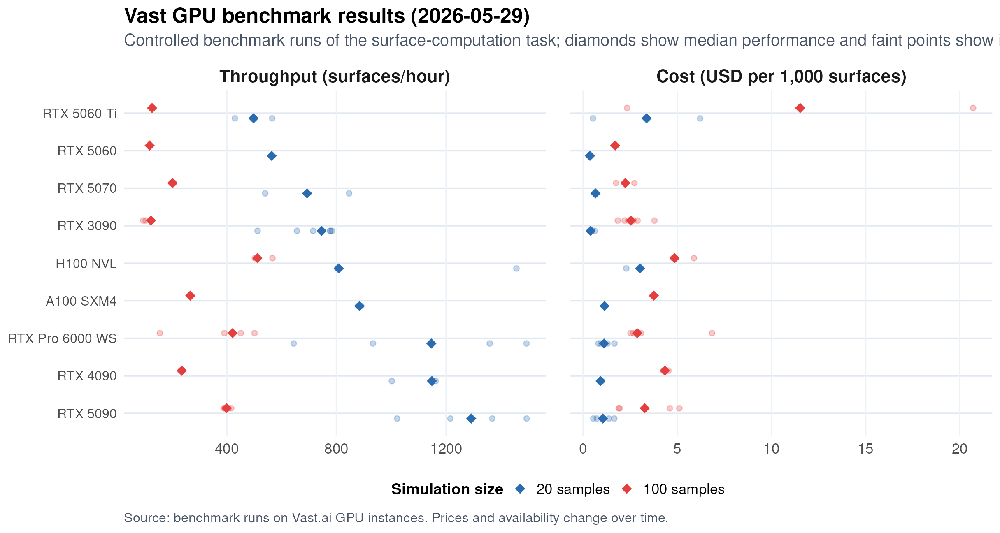
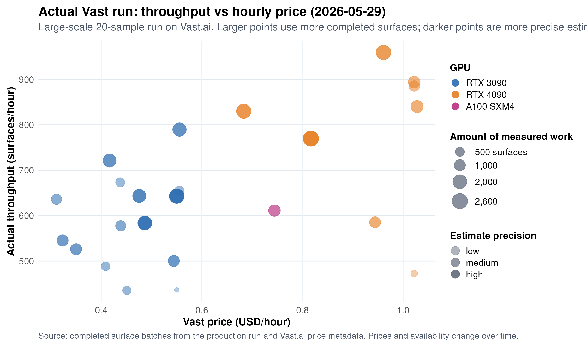

# Vast.ai Surface Pipeline

This run mode uses:

- Redis for chunk locks and a compact completed-surface set.
- S3-compatible object storage for durable averaged surface pickles.
- One Python worker process per GPU.
- One compressed bundle per completed chunk by default, around 50 surfaces
  and roughly 10 MB per object.

The current
`results/averaged_surfaces_10k_100samples_circular` folder is about 5.4 GB
across 29,545 files; a full L2-style canonical averaged-surface set is expected
to be around 6 GB at the current ~188 KiB/object size. With chunk bundling,
that is roughly 650 remote objects instead of ~33k individual surface files.
Use any S3-compatible provider. Backblaze B2 is a good first choice if you want
provider-side caps/alerts; Cloudflare R2 is operationally simple but does not
provide the same hard-stop comfort.

## Required environment

```bash
export REDIS_HOST=...
export REDIS_PORT=...
export REDIS_USERNAME=default
export REDIS_PASSWORD=...
```

For durable uploads, set an S3-compatible bucket:

```bash
export S3_BUCKET=...
export S3_PREFIX=demixing/averaged_surfaces_v1
export S3_ENDPOINT_URL=https://<provider-s3-endpoint>
export AWS_ACCESS_KEY_ID=...
export AWS_SECRET_ACCESS_KEY=...
export AWS_DEFAULT_REGION=auto
```

Docker `--env-file` expects plain `KEY=value` lines, not shell-style
`export KEY=value` lines. If your local `.env` uses `export`, create a Docker
copy before running container smoke tests:

```powershell
(Get-Content .env) -replace '^export\s+', '' | Set-Content .env.docker
```

Verify storage credentials before starting workers:

```bash
python cloud/smoke_object_store.py
```

Verify the Docker image can import the cloud/GPU dependencies:

```bash
docker run --rm andreychetverikov/demixing-vast-nv:latest \
  python3 -c "import boto3, redis, jax; print(jax.devices())"
```

Check remote bundle/Redis progress:

```bash
python cloud/cloud_status.py --registry averaged_surfaces_vast
```

Rebuild or clean Redis completion state from remote manifests:

```bash
python cloud/reconcile_redis_from_storage.py \
  --registry averaged_surfaces_vast \
  --dry-run
```

List objects under the configured remote prefix before deleting old smoke data:

```bash
python cloud/cleanup_remote_prefix.py
```

Deletion requires an explicit confirmation flag:

```bash
python cloud/cleanup_remote_prefix.py --yes --max-delete 1000
```

## GPU Benchmarks

Run a local benchmark smoke before spending Vast credits:

```bash
python cloud/benchmark_gpu_surfaces.py \
  --gpu-name local_smoke \
  --offer-id local \
  --price-per-hour 0 \
  --n-simulations 100 \
  --n-samples 20 \
  --surface-count 1 \
  --no-upload
```

Launch a Vast benchmark for one offer:

```bash
cloud/create_vast_benchmark.sh <offer-id> <gpu-name> <price-per-hour>
```

Benchmark jobs use 10k simulations by default, run both `n_samples=20` and
`n_samples=100`, warm up one untimed surface per condition, time 20 surfaces,
then upload CSV/JSON outputs to:

```text
demixing/benchmarks/gpu_surface_timing
```

## Launch

Build and push the runtime image from the repo root:

```bash
docker build -f cloud/Dockerfile.vast-nv -t demixing-vast-nv:latest .
docker tag demixing-vast-nv:latest andreychetverikov/demixing-vast-nv:latest
docker push andreychetverikov/demixing-vast-nv:latest
```

For a local GPU sanity check before pushing:

```bash
docker run --rm --gpus all demixing-vast-nv:latest \
  python3 -c "import jax; print(jax.devices())"
```

For a one-chunk container smoke test from the repo root:

```powershell
docker run --rm --gpus all `
  --env-file .env.docker `
  -v "${PWD}:/workspace" `
  -w /workspace `
  -e PYTHONPATH=/workspace:/workspace/neural_network_optimization:/workspace/surface_computation `
  -e S3_PREFIX=demixing/docker_smoke `
  -e AVERAGED_SURFACES_DIR=results/averaged_surfaces_docker_smoke `
  -e BUNDLE_DIR=results/averaged_surfaces_docker_smoke_bundles `
  -e COMPLETION_REGISTRY=averaged_surfaces_docker_smoke `
  -e BUNDLE_OUTPUT=1 `
  demixing-vast-nv:latest `
  python3 surface_computation/simulated_samples_grid.py `
    --pipeline `
    --lock-backend redis `
    --averaged-surfaces-dir results/averaged_surfaces_docker_smoke `
    --completion-registry averaged_surfaces_docker_smoke `
    --bundle-output `
    --bundle-dir results/averaged_surfaces_docker_smoke_bundles `
    --chunk-size 5 `
    --max-chunks 1 `
    --n-simulations 100 `
    --n-samples 20
```

Check the uploaded smoke bundle:

```powershell
docker run --rm `
  --env-file .env.docker `
  -v "${PWD}:/workspace" `
  -w /workspace `
  -e PYTHONPATH=/workspace:/workspace/neural_network_optimization:/workspace/surface_computation `
  -e S3_PREFIX=demixing/docker_smoke `
  -e COMPLETION_REGISTRY=averaged_surfaces_docker_smoke `
  demixing-vast-nv:latest `
  python3 cloud/cloud_status.py --registry averaged_surfaces_docker_smoke
```

The image contains the Python/CUDA dependencies plus `git` so the Vast on-start
script can clone this public repo before launching workers.

Use this image name in Vast:

```text
andreychetverikov/demixing-vast-nv:latest
```

## Cost And Performance

Vast.ai pricing and availability change over time, so treat the numbers below
as a dated operating snapshot rather than fixed hardware constants. The plots
were generated on 2026-05-29 from benchmark runs, saved monitor history, Vast
price metadata, and S3 bundle manifests from the large-scale 20-sample surface
run.

The benchmark plot compares controlled runs across GPU types and sample counts.
It is useful for checking broad hardware scaling, but it does not include all
startup, scheduling, or host-specific variation from a full multi-machine run.



The production-run plot uses actual completed surface batches from S3 for the
large 20-sample run. Each point is a machine-price observation: higher is faster,
farther right is more expensive. Larger points are based on more completed
surfaces, and darker points are more precise because that machine worked longer.



In this run, cheaper RTX 3090 instances often gave the best cost/performance.
Fast cards were still useful for throughput, but expensive or slow-host 4090/A100
instances could exceed the target budget once real surface throughput was used
instead of benchmark expectations.

## CLI Launch

Install and configure the Vast CLI locally:

```bash
python -m pip install vastai
vastai set api-key <your-vast-api-key>
```

## Multi-Machine Monitor

For real multi-machine surface simulation runs, use `cloud/vast_monitor.py` as
the main entry point. It keeps a target number of Vast instances running, scans
the market for suitable GPUs, launches workers with the NV Docker image, watches
container logs and S3 bundle manifests for progress, and destroys instances that
are stuck, crashed, or inactive. It writes monitor state to
`logs/vast_monitor_state.json` and fetched instance logs under
`logs/instance_logs/`.

The monitor loads `.env.docker` first and then `.env`, so keep the Redis, S3,
Vast API, and optional Docker credentials there. At minimum, configure the Redis
and S3 variables above plus `VAST_API_KEY` or `VASTAPIKEY`. Set `GIT_REPO` and
`GIT_REF` if the workers should clone something other than `main` from the
default repository.

Start with a dry run to see which offers would be selected:

```bash
../.venv/bin/python cloud/vast_monitor.py \
  --registry averaged_surfaces_vast \
  --s3-prefix demixing/averaged_surfaces_vast \
  --n-simulations 10000 \
  --n-samples 100 \
  --budget 30 \
  --max-concurrent 10 \
  --dry-run
```

Then remove `--dry-run` to let it create and manage instances:

```bash
../.venv/bin/python cloud/vast_monitor.py \
  --registry averaged_surfaces_vast \
  --s3-prefix demixing/averaged_surfaces_vast \
  --n-simulations 10000 \
  --n-samples 100 \
  --budget 30 \
  --max-concurrent 10
```

Useful controls:

- `--budget`: maximum estimated full-pipeline cost per selected offer.
- `--max-concurrent`: target number of active Vast instances.
- `--image`: worker image; defaults to `andreychetverikov/demixing-vast-nv:latest`.
- `--disk`: disk size in GB for each instance; defaults to 60.
- `--poll-interval`: seconds between market/status checks; defaults to 60.
- `--loading-timeout` and `--slowness-check`: when to recycle unhealthy workers.
- `--manage-all`: apply health-kill logic to all visible Vast instances, not only
  instances spawned by this monitor state file.

Stopping the monitor with Ctrl+C stops the local monitoring loop; running Vast
instances continue unless they finish, fail, or are destroyed separately. While
it runs, use `cloud/cloud_status.py` to independently check Redis and object
storage progress.

## Manual One-Off Launch

Find offers, then choose one offer ID:

```bash
vastai search offers "gpu_name=RTX_4090 num_gpus>=1 reliability>0.95 verified=true" \
  --order "dph_total"
```

This workspace has a persistent Vast SSH key registered on the account:

```text
~/.ssh/vast_demixing_ed25519
```

For a newly created instance, get the SSH target and connect with:

```bash
vastai ssh-url <instance-id>
ssh -i ~/.ssh/vast_demixing_ed25519 -p <port> root@<host>
```

If an already-running instance does not have the key attached:

```bash
vastai attach ssh <instance-id> ~/.ssh/vast_demixing_ed25519.pub
```

From Linux, WSL, or this dev container:

```bash
cloud/create_vast_smoke.sh <offer-id>
```

The script reads Redis, R2, and Vast API credentials from environment variables
or local env files, then creates a tiny one-chunk run under
`S3_PREFIX=demixing/vast_smoke`. It intentionally ignores any `S3_PREFIX` in
`.env`; override the smoke prefix with `VAST_SMOKE_S3_PREFIX` if needed.

Create the instance from an offer ID:

```bash
vastai create instance <offer-id> \
  --image andreychetverikov/demixing-vast-nv:latest \
  --disk 40 \
  --ssh \
  --direct \
  --env '-e GIT_REPO=https://github.com/achetverikov/demixing_model.git -e GIT_REF=main -e REPO_DIR=/workspace/demixing_model -e REDIS_HOST=<redis-host> -e REDIS_PORT=6379 -e REDIS_USERNAME=default -e REDIS_PASSWORD=<redis-password> -e S3_BUCKET=demixing-model-20samples -e S3_PREFIX=demixing/vast_smoke -e S3_ENDPOINT_URL=https://<account-id>.r2.cloudflarestorage.com -e AWS_ACCESS_KEY_ID=<r2-key> -e AWS_SECRET_ACCESS_KEY=<r2-secret> -e AWS_DEFAULT_REGION=auto -e AVERAGED_SURFACES_DIR=results/averaged_surfaces_vast_smoke -e COMPLETION_REGISTRY=averaged_surfaces_vast_smoke -e BUNDLE_OUTPUT=1 -e BUNDLE_DIR=results/averaged_surfaces_vast_smoke_bundles -e N_SIMULATIONS=100 -e N_SAMPLES=20 -e GPU_WORKERS=0 -e GRID_LEVEL=1 -e CHUNK_SIZE=5 -e MAX_CHUNKS=1' \
  --onstart-cmd 'cd /workspace && git clone "$GIT_REPO" "$REPO_DIR" && cd "$REPO_DIR" && git checkout "$GIT_REF" && bash cloud/vast_worker.sh'
```

Use the smoke prefix/registry first. After it succeeds, switch to the real
prefix/registry and full dimensions:

```bash
S3_PREFIX=demixing/averaged_surfaces_vast
AVERAGED_SURFACES_DIR=results/averaged_surfaces_vast
COMPLETION_REGISTRY=averaged_surfaces_vast
BUNDLE_DIR=results/averaged_surfaces_vast_bundles
N_SIMULATIONS=10000
N_SAMPLES=100
GRID_LEVEL=1
```

For Vast `onstart`, set `GIT_REPO`, secrets, and runtime vars from
`cloud/env.vast.example`, then use:

```bash
bash cloud/vast_onstart.sh
```

If the repo is already mounted or cloned inside the container, run workers
directly:

```bash
bash cloud/vast_worker.sh
```

Common overrides:

```bash
export AVERAGED_SURFACES_DIR=results/averaged_surfaces_vast
export COMPLETION_REGISTRY=averaged_surfaces_vast
export BUNDLE_OUTPUT=1
export BUNDLE_DIR=results/averaged_surfaces_vast_bundles
export N_SIMULATIONS=10000
export N_SAMPLES=100
export GPU_WORKERS=0,1
export GRID_LEVEL=1
```

With bundle output enabled, each worker writes individual surfaces locally while
processing a chunk, uploads the completed chunk bundle and manifest, then marks
those surfaces complete in Redis. On startup, workers list object storage and
repopulate the Redis completed set, so Redis can be rebuilt from the durable
bucket if needed.

## After Compute

Downstream training and browser tools still expect individual averaged surface
files. After compute finishes, sync bundles from object storage:

```bash
python cloud/sync_surface_bundles.py \
  --output-dir results/averaged_surfaces_vast_bundles
```

Then unpack them:

```bash
python cloud/unpack_surface_bundles.py \
  --bundle-dir results/averaged_surfaces_vast_bundles \
  --output-dir results/averaged_surfaces_vast
```

Then train using the normal averaged-surface directory:

```bash
python neural_network_optimization/mirror_aware_training.py \
  --surfaces-folder results/averaged_surfaces_vast
```
